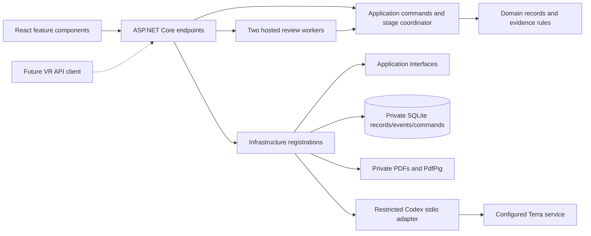

# Architecture

The application is a modular monolith: one ASP.NET Core process, one private local SQLite database, and a React client. There are four production projects; test projects are separate.

**Project references:** Domain → none; Application → Domain; Infrastructure → Application; API → Infrastructure/Application. Architecture tests enforce these references and prohibit HTTP/SQLite/PDF dependencies in Domain/Application. `ApplicationBootstrap` is the dependency-injection composition root.

## Responsibilities

- Domain defines case, branch, snapshot, finding, citation and coverage data, deterministic date/amount checks, and citation rules.
- Application owns authenticated-owner use cases, lifecycle/revision rules, immutable snapshots, explicit review stages, coverage audit/recheck, interventions, conservative comparison, and exports. It depends on focused persistence, PDF, model, queue and telemetry interfaces.
- Infrastructure implements those interfaces with parameterized SQLite, contained private paths, PdfPig extraction, Codex JSON-RPC, resource loading, queue admission and restart recovery.
- API binds requests, checks sessions/local access, serves authorized PDFs, streams events, runs hosted workers and serves the built frontend.

## Concurrency and persistence invariants

The queue permits **two executing reviews, six model calls process-wide, and twenty waiting jobs**. Queue capacity is reserved before creating a review; a full queue returns HTTP 429 without a phantom review. Duplicate command IDs return their original result without creating another job. A duplicate ID with a different payload is a conflict.

Each review has one coordinator. Parallel specialists return results through a channel instead of modifying shared collections. Updates refuse to overwrite cancelled or deleted work. Pause occurs at a completed-stage boundary; queued interventions are serialized. Evidence can advance to a new revision while the old review finishes against its original snapshot. Confirming details and case lifecycle actions retain their active-work guards.

SQLite operations are short and serialized under a local gate. Command mutation and deduplication are one transaction, outside model calls. `PRAGMA user_version` defines schema version 1. Unknown newer schemas are rejected. A held `server.lock` prevents two processes opening the same data directory. This is deliberately a local single-process design, not distributed transaction coordination.

Events have persistent increasing IDs. SSE sends heartbeat comments and supports replay; polling reads saved snapshots/events. Saved reviews and their snapshot pages support historical finding navigation. Restart marks interrupted work incomplete and never automatically submits model work again.

## Review stages

1. Independent specialist assessment of the same snapshot.
2. Within that stage: nineteen-topic coverage validation, lead audit questions, at most one specialist recheck per affected role.
3. Cross-review: at most two material questions per specialist; no required disagreement.
4. One response per challenged reviewer/finding; preserve disagreement.
5. Lead synthesis of saved evidence, coverage and remaining human work.

The wire protocol keeps four original stage indexes: audit/recheck are substeps of independent review. Single-specialist and single-reviewer evaluation modes retain partial scope. Lead-only regeneration reuses the selected review's findings. Human interventions prompt one responsible specialist and then the lead.

## Evidence and model boundaries

PdfPig extracts text-only pages; PDF.js renders the original file in the browser. Intake enforces 10 MB, 20 pages per PDF and 100 active-case pages. Encrypted and malformed files fail explicitly; unreadable pages are flagged. Prepared PDFs and versioned rules/catalog/schema resources are embedded in Infrastructure. Reproduction scripts remain development tooling.

Codex uses existing external credentials and restricted ephemeral threads. Review sessions have no general tools. Schemas, output validation and page-quote provenance checks precede acceptance. Formatting/citation repair is bounded; transport/usage failures are explicit. Quote matching does not prove a conclusion true. Prompt-injection instructions inside documents remain untrusted evidence.

## Frontend

React retains TypeScript, Vite, React Flow, PDF.js and Markdown rendering. Feature folders separate documents, findings, discussion, review, cases, comparison and notes; shared hooks own transport state. Generated OpenAPI DTOs remain separate from view models. Rendering never substitutes a new underwriting decision for saved evidence. CSS is split by shared controls and feature concerns without redesigning the screens.

## Extension points and limits

Hosted authentication, distributed workers, PostgreSQL, production documents, OCR and VR remain deferred. A distributed version would need durable queue leases, cross-process consistency, proper user/tenant authentication, object storage and operational monitoring. Replacing an interface is not proof that those requirements are solved. Current measured behavior is recorded in VALIDATION.md.
